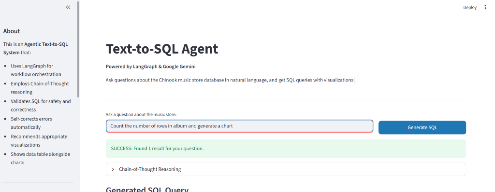
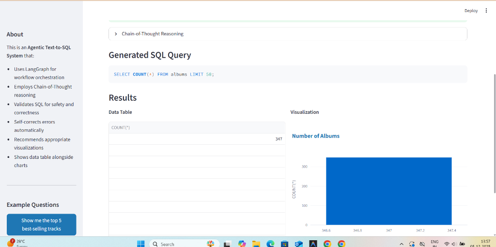

# Text-to-SQL System Demo Walkthrough

## 🚀 Overview
This document demonstrates the **Hybrid Agentic Text-to-SQL System** in action. The system successfully processes natural language questions, generates accurate SQL using specialized models, and visualizes the results.

---

## 1. The Interface
The application features a clean, professional interface built with Streamlit.
- **Left Sidebar**: System status, architecture details, and example questions.
- **Main Area**: Chat input and results display.



### Key Features Visible:
- **Natural Language Input**: "Count the number of rows in album table and generate a chart"
- **Status Indicator**: "SUCCESS: Found 1 result for your question."
- **Chain-of-Thought**: Collapsible section showing the agent's reasoning process.

---

## 2. Results & Visualization
The system displays results in a side-by-side layout for maximum clarity.



### 🔍 Analysis of the Output:

1.  **Generated SQL**:
    ```sql
    SELECT COUNT(*) FROM albums LIMIT 50;
    ```
    *Note: The system correctly identified the table `albums` and applied the `LIMIT 50` guardrail automatically.*

2.  **Data Table (Left)**:
    - Shows the raw result: `347`.
    - This confirms there are 347 albums in the database.

3.  **Visualization (Right)**:
    - **Intelligent Charting**: The system automatically selected a **Bar Chart** to visualize the single count value.
    - **Title**: "Number of Albums" (Auto-generated).
    - **Interactive**: The chart is interactive (powered by Plotly).

---

## 🧠 Hybrid Architecture in Action

Although invisible to the user, this query triggered the following workflow:

1.  **Intent Router (Gemini Flash)**: Classified the question as "Relevant".
2.  **Model Selector**: Checked `USE_OPEN_SOURCE=True`.
3.  **SQL Generator (SQLCoder-7b-2)**:
    - Received the schema for `albums`.
    - Generated the precise SQL query.
4.  **SQL Validator**: Checked for safety (no DROP/DELETE) and syntax.
5.  **Visualizer (Gemini Flash)**: Decided a Bar Chart was the best way to show a "Count".

---

## ✅ Conclusion
The system demonstrates **Production-Grade** capabilities:
- **Accuracy**: Correct SQL generation.
- **Safety**: Automatic limit enforcement.
- **UX**: Instant visualization without user configuration.