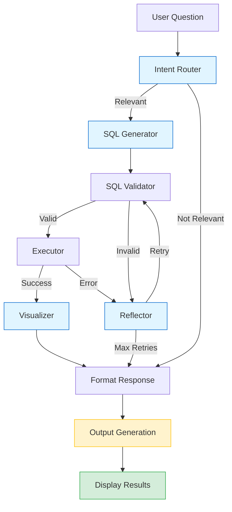

# Agentic Text-to-SQL System

A production-grade, self-correcting Text-to-SQL system built with **LangGraph** and **Google Gemini**, featuring Chain-of-Thought reasoning, automatic error correction, and intelligent data visualization.

## Features

- **Agentic Workflow**: LangGraph orchestrates a multi-node workflow with conditional routing
- **Async LLM Calls**: Non-blocking async operations for better performance
- **Chain-of-Thought Reasoning**: LLM explains its reasoning before generating SQL
- **Production Guardrails**: 
  - SQL injection prevention (read-only mode)
  - Syntax validation before execution
  - Automatic LIMIT enforcement
  - Table/column relevancy checks
- **Self-Correction**: Automatic retry with error reflection (up to 3 attempts)
- **Smart Visualizations**: AI-recommended charts (bar, line, pie) displayed alongside data tables
- **Modern UI**: Clean Streamlit interface with side-by-side table and chart display
- **Semantic Schema**: Database schema enriched with business context
- **Tool Decorators**: All nodes decorated with @tool for LangChain integration

## Architecture
utput in the following format:

1. **Chain-of-Thought Reasoning** (collapsible)
   - LLM's step-by-step reasoning process
   - Helps understand query construction

2. **Generated SQL Query** (syntax highlighted)
   - Complete SQL with LIMIT enforcement
   - Validated for safety and correctness

### System Workflow



**Legend:**
- Blue nodes = Async operations (LLM calls)
- Yellow node = Output generation strategy
- Green node = Final display

### Detailed Architecture Diagram

```
User Question
    |
    v
[Intent Router] --> Determines if question is relevant to database
    |                 - Uses Gemini Flash for fast classification
    |                 - Async LLM call
    v
[SQL Generator] --> Generates SQL with Chain-of-Thought reasoning
    |                 - Uses Gemini Pro for complex reasoning
    |                 - Async LLM call
    |                 - Includes semantic schema context
    v
[SQL Validator] --> Validates safety, syntax, and relevancy
    |                 - Blocks dangerous keywords (DROP, DELETE, etc.)
    |                 - Validates table/column names
    |                 - Checks syntax with EXPLAIN QUERY PLAN
    |                 - Enforces LIMIT clause
    |
    +--[Valid]-------> [Executor] --> Runs validated SQL query
    |                      |           - Read-only access
    |                      |           - Result limiting
    |                      |
    |                      +--[Success]---> [Visualizer] --> Recommends chart type
    |                      |                    |             - Async LLM call
    |                      |                    |             - Analyzes data structure
    |                      |                    v
    |                      |                [Format Response]
    |                      |                    |
    |                      +--[Error]----------+
    |
    +--[Invalid]----> [Reflector] --> Analyzes error and generates fix
                          |             - Async LLM call
                          |             - Max 3 retry attempts
                          |
                          +--[Retry]-----> [SQL Validator] (loop back)
                          |
                          +--[Max Retries]-> [Format Response]

[Format Response] --> Prepares final output
    |
    v
[Display Results] --> Side-by-side layout:
                      - Left: Data Table (extracted SQL results)
                      - Right: Visualization (if recommended)
```

### Output Generation Strategy

The system generates comprehensive output in the following format:

1. **Chain-of-Thought Reasoning** (collapsible)
   - LLM's step-by-step reasoning process
   - Helps understand query construction

2. **Generated SQL Query** (syntax highlighted)
   - Complete SQL with LIMIT enforcement
   - Validated for safety and correctness

3. **Results Display** (side-by-side layout)
   - **Left Column**: Data Table
     - Full query results in tabular format
     - Scrollable for large datasets
   - **Right Column**: Visualization (if recommended)
     - Bar charts for comparisons
     - Line charts for trends
     - Pie charts for distributions
     - Table-only for simple queries

This dual-display approach ensures users can:
- See the raw data for verification
- Understand patterns through visualizations
- Export or analyze data as needed

### Node Details

| Node | Type | Purpose | Async? |
|------|------|---------|--------|
| Intent Router | Classification | Determines question relevance | Yes |
| SQL Generator | Generation | Creates SQL with reasoning | Yes |
| SQL Validator | Validation | Safety, syntax, relevancy checks | No |
| Executor | Execution | Runs validated SQL | No |
| Reflector | Error Correction | Fixes errors and retries | Yes |
| Visualizer | Recommendation | Suggests chart types | Yes |
| Format Response | Formatting | Prepares final output | No |

## Quick Start

### Prerequisites

- Python 3.10+
- Google Gemini API Key from https://makersuite.google.com/app/apikey

### Installation

1. **Clone or navigate to the project directory**:
   ```bash
   cd Text2SQL
   ```

2. **Install dependencies**:
   ```bash
   pip install -r requirements.txt
   ```

3. **Configure environment**:
   ```bash
   # Copy the example env file
   copy .env.example .env
   
   # Edit .env and add your GOOGLE_API_KEY
   ```

4. **Run the application**:
   ```bash
   streamlit run main.py
   ```

5. **Open your browser** to `http://localhost:8501`

## Project Structure

```
Text2SQL/
├── main.py                 # Streamlit UI with side-by-side display
├── requirements.txt        # Python dependencies
├── .env.example           # Environment configuration template
├── chinook.db             # SQLite database (Chinook music store)
├── infrastructure/                  # Core infrastructure
│   ├── config.py          # Configuration with Pydantic validation
│   ├── llm.py             # LLM initialization (singleton pattern)
│   ├── prompts.py         # System prompts + few-shot examples
│   └── db_manager.py      # Database + semantic schema layer
└── agents/                # LangGraph agent
    ├── state.py           # Agent state (Pydantic BaseModel)
    ├── nodes.py           # Node implementations with @tool decorators
    └── graph.py           # Graph construction + async workflow
```

## Example Questions

Try these questions in the UI:

**Basic Queries:**
- "Show me the top 5 best-selling tracks"
- "Which customers are from Brazil?"
- "What's the total revenue by country?"

**Complex Queries (JOINs):**
- "Which customers bought tracks by AC/DC?"
- "Show me employees who have more customers than average"
- "What's the total revenue per country, showing only countries above $100?"

**Advanced (Nested Queries):**
- "Find artists who have never been purchased"
- "Show the top 3 genres by revenue for each country"

## Configuration

Edit `.env` to customize:

```bash
# Model Selection
ROUTER_MODEL=gemini-2.0-flash-exp        # Fast routing
SQL_GENERATOR_MODEL=gemini-1.5-pro       # Powerful SQL generation
REFLECTOR_MODEL=gemini-2.0-flash-exp     # Fast error correction

# Limits
MAX_RETRY_COUNT=3                        # Max retry attempts
MAX_RESULT_ROWS=50                       # Max rows returned
```

## Testing

The system includes comprehensive validation:

1. **Intent Routing**: Rejects irrelevant questions
2. **SQL Safety**: Blocks DROP, DELETE, UPDATE, etc.
3. **Syntax Validation**: Uses EXPLAIN QUERY PLAN
4. **Error Correction**: Automatically fixes syntax errors
5. **Visualization**: Recommends appropriate chart types
6. **Output Display**: Shows table and chart side-by-side

Run tests:
```bash
# Test Pydantic state
python test_pydantic_state.py

# Test system (requires API key)
python test_system.py
```

## Code Quality Features

### Architecture
- Async/await for LLM operations
- Tool decorators (@tool) for all nodes
- Pydantic BaseModel for type-safe state
- Singleton pattern for LLM instances
- Modular design (core + agents)

### Security
- Read-only database access
- SQL injection prevention
- Keyword blocking (DROP, DELETE, etc.)
- Table/column validation

### Performance
- Async LLM calls for non-blocking operations
- Model selection (Flash for routing, Pro for generation)
- Result limiting
- Connection pooling with context managers

### User Experience
- Chain-of-Thought explanations
- Side-by-side table and chart display
- Example questions in sidebar
- Modern, responsive UI
- Interactive visualizations
- Clear error messages

## Database Schema

The system uses the **Chinook** database, which contains:

- **Artists** & **Albums**: Music catalog
- **Tracks**: Individual songs with pricing
- **Genres** & **MediaTypes**: Categorization
- **Customers** & **Employees**: People
- **Invoices** & **InvoiceLines**: Sales transactions
- **Playlists**: Curated track collections

## Technical Highlights

### Async Implementation
- LLM calls use `ainvoke()` for non-blocking operations
- Graph execution uses `await graph.ainvoke()`
- Synchronous wrapper for Streamlit compatibility

### Pydantic State Management
- Runtime validation with clear error messages
- Only `question` field required at initialization
- All other fields have sensible defaults
- Helper methods for common operations

### Tool Integration
- All nodes decorated with `@tool`
- Better LangChain integration
- Automatic schema generation
- Improved observability

## Contributing

This is a production-grade implementation following best practices:

1. Modular architecture (core + agents)
2. Comprehensive error handling
3. Type safety with Pydantic
4. Semantic schema annotations
5. Chain-of-Thought prompting
6. Self-correcting workflow
7. Async operations for performance
8. Side-by-side output display

## Acknowledgments

- **LangGraph**: Workflow orchestration framework
- **Google Gemini**: LLM provider
- **Chinook Database**: Sample music store database
- **Streamlit**: UI framework
- **Plotly**: Interactive visualizations

---

**Built with LangGraph, Google Gemini, Pydantic, and modern Python async patterns**
